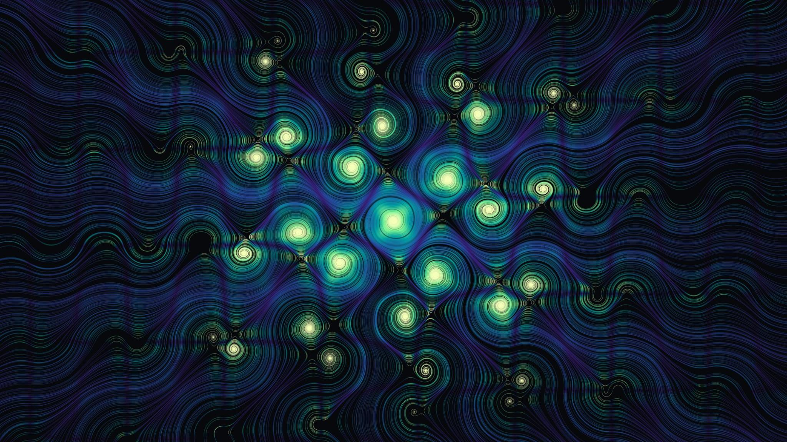
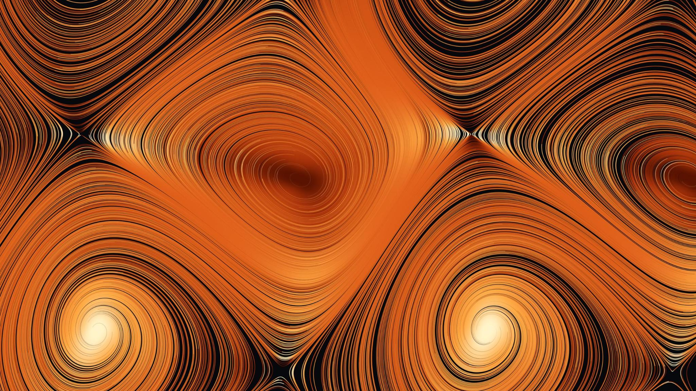

# Tan Trajectories

Wallpaper generator that traces trajectories of two planar ODE families built on `tan()`,
colouring each point of a curve by the local curvature of the trajectory.

**Try it online: https://jtreguer.github.io/tan-trajectories/**



## Running it

Use the [online version](https://jtreguer.github.io/tan-trajectories/), or clone the
repository and open `index.html` directly in a browser. There is no build step, no dependency and no
server. The page renders a live preview as you move the sliders, and the button at the
bottom of the panel renders the image at full resolution and downloads it as a PNG.

## How it works

Each system defines a vector field `(x', y')` on the plane. The renderer scatters a number
of random starting points over the visible area (plus a 15% margin, so curves can enter
from off-screen), then follows the field from each one with a fourth-order Runge-Kutta
integrator. The field is normalised to unit speed, so every trajectory advances at the same
rate regardless of how strong the field is locally, and integration stops when a curve
leaves the view, reaches its maximum length, or lands on a fixed point where the field
vanishes.

At every step the renderer measures the curvature κ of the trajectory, i.e. how fast its
direction is turning. That value is mapped through the chosen palette and drawn as a small
Gaussian dot. Where many curves overlap, their colours are averaged and the pixel becomes
more opaque, so dense regions glow and sparse ones fade into the background. Tight spirals
around a vortex have high curvature, which is why their centres light up at the bright end
of the palette.

Rendering runs in a Web Worker, so the page stays responsive during long renders. The
preview is drawn at screen size with a coarser integration step; the downloaded PNG uses
the full output resolution and half the step size.

## Equation systems

### Damped whirlpools

```
x' =  tan(k·sin(ω·y)) − d·x
y' = −tan(k·sin(ω·x)) − d·y
```

A periodic grid of vortices pulled towards the origin by a linear damping term. The image
above comes from this system.

| Parameter | Range | Effect |
|---|---|---|
| **k** (tan gain) | 0.2 – 1.55 | Strength of the swirl. `tan` blows up near π/2 ≈ 1.57, so values close to the top of the range give sharp, high-contrast vortices. |
| **ω** (frequency) | 0.2 – 3 | Spatial frequency of the sine terms. Higher values pack more vortices into the same area. |
| **d** (damping) | 0 – 0.6 | Pull towards the origin. At 0 the pattern is an even, repeating lattice; larger values make curves spiral inwards and concentrate the image around the centre. |

### Mixed-angle spirals

```
x' =  b·sin(y) + tan(a·cos(x+y))
y' = −b·sin(x) + tan(a·sin(x−y))
```

A rotational field disturbed by diagonal shear terms, producing chains of spirals.



| Parameter | Range | Effect |
|---|---|---|
| **a** (tan gain) | 0.05 – 1.55 | Strength of the diagonal shear. Low values leave the regular rotation of the `b` term almost intact; high values break it into stretched, asymmetric spirals. |
| **b** (rotation) | 0 – 2 | Strength of the rotational part. At 0 only the shear remains. |

### Presets

Each system comes with presets that set its parameters and the view together. Moving any
equation or view slider switches the preset menu to **custom**. Changing the system resets
the parameters to its first preset.

## Controls

### View

| Slider | Range | Effect |
|---|---|---|
| **Centre x / Centre y** | −15 – 15 | Point of the plane shown at the centre of the image. |
| **Visible height** | 2 – 60 | Height of the visible area in world units. The width follows from the output aspect ratio. Smaller values zoom in. |

### Trajectories

| Control | Range | Effect |
|---|---|---|
| **Number of trajectories** | 100 – 6000 | How many starting points are scattered. More trajectories give a denser image and a longer render. |
| **Max length per trajectory** | 2 – 120 | Arc length (in world units) after which a curve stops. Short values give short strokes; long values let curves wind all the way into vortices. |
| **Random seed** | any integer | Seeds the placement of starting points. The same seed and settings always give the same image. **Shuffle** picks a new one. |
| **Trace backward in time as well** | on/off | Also follows each curve in the reverse direction from its starting point, so curves extend on both sides and the image fills more evenly. |

### Colour

| Control | Range | Effect |
|---|---|---|
| **Palette** | 9 palettes | Colour ramp used to map curvature to colour: Magma, Viridis, Ocean, Ember, Aurora, Rose quartz, Neon, Gold and Ink (mono). The strip below the menu previews it. |
| **Reverse palette** | on/off | Flips the ramp end to end. |
| **Colour driven by** | — | **Curvature magnitude \|κ\|**: straight segments take the start of the palette and tight turns the end. **Signed curvature κ**: left turns and right turns go to opposite ends of the palette, with straight segments in the middle, which shows the rotation direction of each vortex. |
| **Curvature scale** | 0.05 – 10 | Curvature at which the colour approaches the end of the palette (the mapping is a `tanh` of κ divided by this value). Lower values push more of the image towards the bright end; higher values reserve it for the tightest turns. |
| **Line width** | 0.5 – 4 | Width of each stroke in pixels at full resolution. It is scaled down in the preview so the preview matches the final look. |
| **Exposure** | 0.02 – 2 | How quickly overlapping strokes become opaque. Low values give faint, ghostly lines; high values saturate dense areas. |
| **Background** | colour | Colour shown wherever no trajectory passes. |

### Output

| Control | Effect |
|---|---|
| **Resolution** | 1920 × 1080 or 2560 × 1440. Also sets the aspect ratio of the preview. |
| **Render full resolution & download PNG** | Renders at the chosen resolution and saves a file named after the system, palette, size and seed. |

## Code layout

- `flow.js`: equation systems, presets, palettes and the renderer (runs in a Web Worker)
- `app.js`: UI wiring, preview and full-resolution PNG export
- `index.html`: page layout and styles
- `gallery/`: example renders

To add a system or preset, edit `SYSTEMS` in `flow.js`; the UI picks it up automatically.
A system needs a `label`, a `formula` string for display, a `params` object describing its
sliders, a `field(p)` function returning `(x, y) => [x', y']`, and at least one preset
that gives a value for every parameter plus `cx`, `cy` and `span`.

## License

MIT. See [LICENSE](LICENSE).
